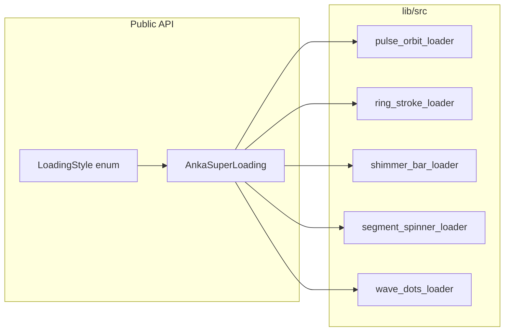

# anka_super_loading_package: implement, example QA, publish

## Current baseline

- Package entry [lib/anka_super_loading_package.dart](lib/anka_super_loading_package.dart) still contains a placeholder `Calculator`; it will be removed in favour of the API in the analysis doc.
- Example [example/lib/main.dart](example/lib/main.dart) imports the package but does not exercise loaders; [example/pubspec.yaml](example/pubspec.yaml) already uses `path: ../`.
- [docs/analysis.md](docs/analysis.md) is the spec: five styles, `LoadingStyle`, `AnkaSuperLoading`, `lib/src/` layout, semantics, reduced motion, example IA.
- [LICENSE](LICENSE) exists (required for pub.dev). [CHANGELOG.md](CHANGELOG.md) exists but is a stub.

## Architecture (target)

Shared behaviour (default size 48, colour from `Theme.colorScheme.primary` when null, `LayoutBuilder` / `ConstrainedBox` for square bounds, `Semantics` for indeterminate progress) should live in [lib/src/super_loading.dart](lib/src/super_loading.dart) or a tiny `internal/` helper so each loader stays focused on painting / transforms.

## Phase 1 — Package skeleton and API

1. Add [lib/src/loading_style.dart](lib/src/loading_style.dart): `enum LoadingStyle` with the five values aligned with analysis (`pulseOrbit`, `ringStroke`, `shimmerBar`, `segmentSpinner`, `waveDots`); stable names matter for semver later.
2. Add [lib/src/super_loading.dart](lib/src/super_loading.dart): `AnkaSuperLoading` with `style`, optional `size`, `color`, `duration`, `semanticsLabel`; dispatch to the correct private/public sub-widget.
3. Add optional style-specific widgets under `lib/src/` (as in analysis) if you want explicit imports; otherwise keep them private and export only the barrel.
4. Replace [lib/anka_super_loading_package.dart](lib/anka_super_loading_package.dart) with a **barrel** that exports `LoadingStyle`, `AnkaSuperLoading`, and any public sub-widgets.
5. Remove dead code (`Calculator`) and fix/remove [test/](test/) if it still references the old API (add loader smoke tests in Phase 3).

**Reduced motion:** when `MediaQuery.disableAnimations` is true, show a static substitute (documented per style in code comments).

## Phase 2 — Five loaders (implementation order from analysis)

Implement in this order to unblock visuals early and leave shimmer edge cases last:

| Order | File | Notes |
|-------|------|-------|
| 1 | `ring_stroke_loader.dart` | `CustomPainter` + `AnimationController` repeat; arc sweep. |
| 2 | `pulse_orbit_loader.dart` | Three dots; staggered scale/opacity. |
| 3 | `wave_dots_loader.dart` | Row of dots; `Transform.translate` with phase offset. |
| 4 | `segment_spinner_loader.dart` | Multiple arcs; staggered rotation. |
| 5 | `shimmer_bar_loader.dart` | Gradient animation; test RTL (`Directionality`) or document LTR-only in README if deferred. |

Each loader: one `AnimationController`, `dispose` correctly, no unnecessary `setState` on parent.

## Phase 3 — Automated tests (package root)

- Add a **smoke test** file (e.g. [test/anka_super_loading_smoke_test.dart](test/anka_super_loading_smoke_test.dart)): for each `LoadingStyle`, `pumpWidget` with `MaterialApp` + `AnkaSuperLoading`, pump a few frames, assert no throw and semantics if applicable.
- Optionally add **golden** tests later (not blocking first publish if CI is not set up); note cost of maintaining goldens across Flutter versions.

Run `flutter test` from repo root before publish.

## Phase 4 — Example app (manual testing)

Refactor [example/lib/main.dart](example/lib/main.dart) into a small structure (same file or `example/lib/pages/` if cleaner):

- **MaterialApp** with `theme`, `darkTheme`, and `themeMode` state; **AppBar action** or menu for light/dark/system.
- **Home (gallery):** `ListView` / cards: one row per `LoadingStyle` with English title + one-line description; `onTap` → detail route.
- **Style detail:** large `AnkaSuperLoading`, **Sliders** for size and duration scale, **colour chips** (or `ColorScheme` swatches) for `color`; optional static code snippet `Text` showing typical usage.
- Optional **layout sandbox** (tight `SizedBox`, `Expanded`): only if time allows; analysis marks it optional.

Verify on at least one device or simulator you care about (e.g. iOS or Chrome).

## Phase 5 — Documentation and versioning (pre-publish)

- **[README.md](README.md):** installation (`flutter pub add anka_super_loading_package` once published, or path for now), minimal code sample, table of `LoadingStyle` vs description, link to [docs/analysis.md](docs/analysis.md) for contributors, screenshots or placeholders for “add GIFs later”.
- **[CHANGELOG.md](CHANGELOG.md):** first real entry matching the version you ship (e.g. `0.1.0` — first public API with five loaders); follow project rule: version in [pubspec.yaml](pubspec.yaml) must match the top changelog heading (see [.cursor/rules/package-versions.mdc](.cursor/rules/package-versions.mdc)).
- **[pubspec.yaml](pubspec.yaml):** set `description`, `homepage` and/or `repository` (pub.dev scores and trust); bump from `0.0.1` to **`0.1.0`** for the first meaningful API (recommended before `1.0.0` unless you commit to stability).
- **Exports:** ensure no `src/` files are accidentally exported except through the barrel.

## Phase 6 — Publish to pub.dev

1. **Account:** ensure you are logged in (`dart pub login`) with a pub.dev account that owns or is uploader for the package name `anka_super_loading_package` (name must be available on pub.dev).
2. **Policies:** confirm LICENSE text matches your intent; add `topics:` in pubspec if you want discoverability (optional).
3. **Validation:** run `dart pub publish --dry-run` from package root; fix any “has no README”, missing license, or file inclusion warnings.
4. **Publish:** `dart pub publish` when dry-run is clean.
5. **Post-publish:** tag the git commit (`v0.1.0`), optionally push tags; update README example to pub.dev version constraint after first successful publish.

## Risk note

If `anka_super_loading_package` is already taken on pub.dev, you will need a renamed package (`pubspec.yaml` `name:`) and updated imports in the example — check name availability before the final publish step.
