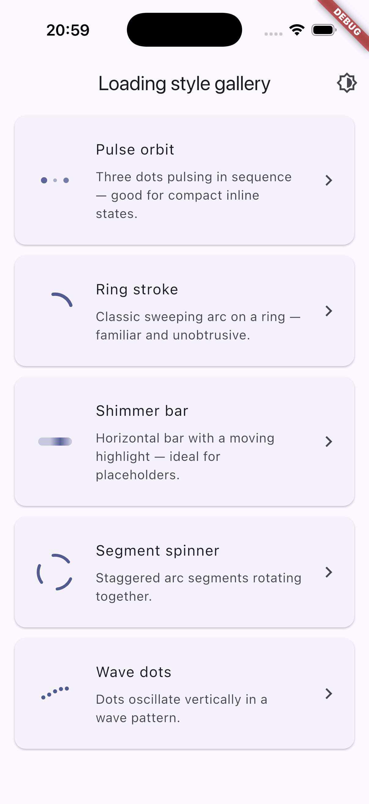
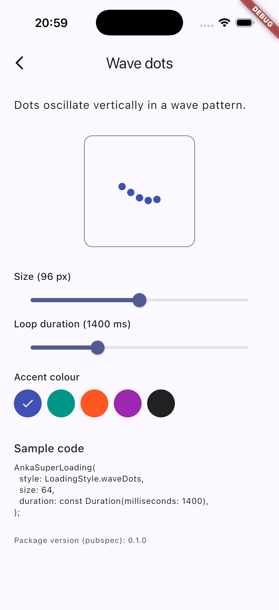
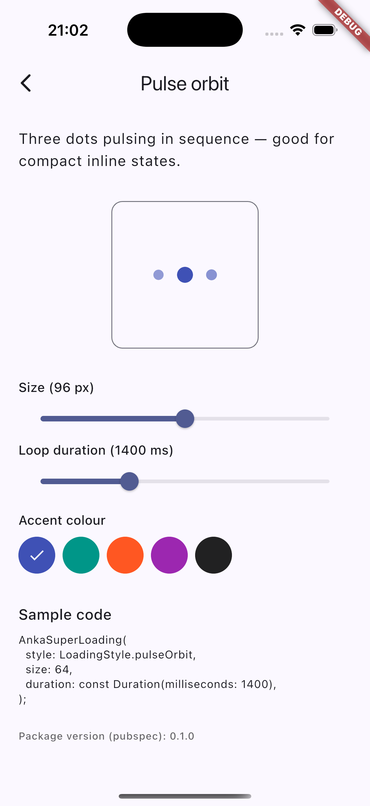

# anka_super_loading_package

Five curated **indeterminate** loading animations for Flutter behind one small API: pick a [`LoadingStyle`](lib/src/loading_style.dart) and drop in [`AnkaSuperLoading`](lib/src/super_loading.dart). The bundled **example** app is the quickest way to compare presets side by side, tune `size` / `duration` / `color`, and flip **light / dark / system** theme from the app bar—the captures below are all from that app (iOS Simulator).

Design notes and roadmap live in [doc/analysis.md](doc/analysis.md).

## Styles

The gallery lists presets in **enum order** (`LoadingStyle.values`): each card shows a live `AnkaSuperLoading` thumbnail, the same human-readable title used in the example, and a short subtitle. Tap a row to open the detail playground (two styles are shown under **Style playground** below).

| `LoadingStyle` | Description |
|----------------|-------------|
| `pulseOrbit` | Three dots with a sequential pulse / scale wave. |
| `ringStroke` | Indeterminate circular stroke with a sweeping arc. |
| `shimmerBar` | Rounded bar with a travelling highlight (shimmer). |
| `segmentSpinner` | Short arc segments rotating with staggered phase. |
| `waveDots` | A row of dots oscillating vertically in a wave pattern. |

### Gallery: every preset in one list



*The example home screen lists all five styles. Use the brightness icon to cycle **system → light → dark** theme and check contrast.*

### Style playground (detail)

Tapping any gallery row opens the same **playground** for that preset: bordered live preview, **size** (32–160 px) and **loop duration** (600–3200 ms) sliders, **accent colour** chips, and a copy-ready `AnkaSuperLoading` snippet aligned with the [`AnkaSuperLoading`](lib/src/super_loading.dart) constructor.

**Wave dots** — preview, controls, and snippet for `LoadingStyle.waveDots`:



**Pulse orbit** — the same surface for `LoadingStyle.pulseOrbit` (only the style name, artwork, and generated snippet change):



## Install

```yaml
dependencies:
  anka_super_loading_package: ^0.1.2
```

```bash
dart pub add anka_super_loading_package
```

## Usage

```dart
import 'package:anka_super_loading_package/anka_super_loading_package.dart';

AnkaSuperLoading(
  style: LoadingStyle.ringStroke,
  size: 64,
  color: Theme.of(context).colorScheme.primary,
  duration: const Duration(milliseconds: 1400),
  semanticsLabel: 'Loading data',
);
```

When `color` is omitted, loaders use `Theme.of(context).colorScheme.primary`. When `size` is omitted, the default side length is `48` (`kAnkaDefaultLoadingSize`). When `duration` is omitted, the default is `1400` ms (each loader interprets that as one loop where applicable). The widget wraps content in `Semantics` with `semanticsLabel ?? 'Loading'`. If `MediaQuery.disableAnimations` is true, each style shows a static frame instead of animating.

## Example

Run the bundled gallery from the repository root:

```bash
cd example
flutter run
```

Screenshots above come from [`assets/screenshots/`](assets/screenshots/) in this repo; those paths resolve on [pub.dev](https://pub.dev) because the images ship with the published package.

## Contributing

Issues and pull requests are welcome on [GitHub](https://github.com/NurhayatYurtaslan/anka_super_loading_package).
